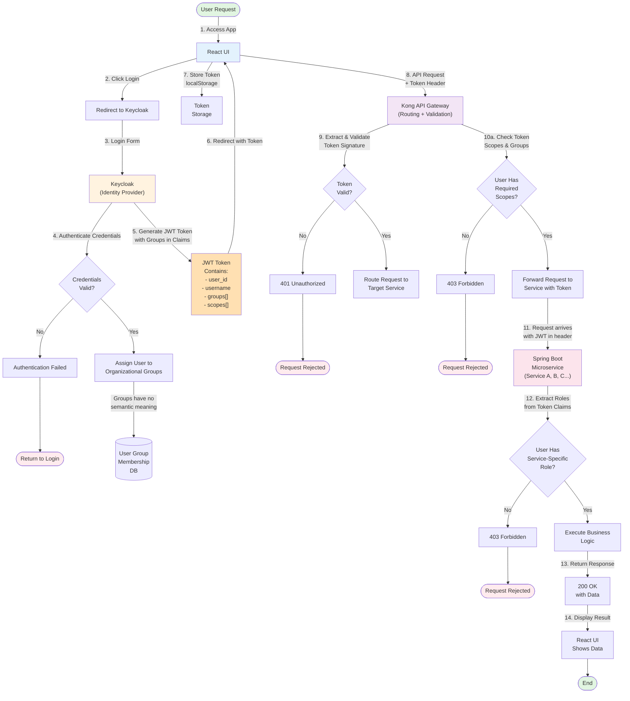

# Current Authentication Flow (Broken State)

## Overview

This diagram illustrates the current authentication and authorization flow in the james-project system. The flow demonstrates how users are authenticated via Keycloak, assigned to groups, given roles, and how those roles are validated across Kong and the microservices.

## Authentication Flow Diagram

## Flow Description

### Phase 1: User Authentication (Steps 1-5)
1. User accesses the React application
2. React UI detects unauthenticated state and redirects to Keycloak login
3. Keycloak presents login form
4. User enters credentials
5. Keycloak validates credentials:
   - On failure: User is returned to login screen
   - On success: User is assigned to organizational groups (with no semantic meaning in the current system)

### Phase 2: Token Generation & Storage (Steps 5-7)
6. Keycloak generates a JWT token containing:
   - User identification (user_id, username)
   - Group memberships (organizational groups)
   - Scopes (broad permission identifiers)
7. Token is sent back to React UI in redirect
8. React stores token in localStorage

### Phase 3: API Request with Token (Steps 8-10)
9. React UI makes API request with token in Authorization header
10. Kong API Gateway receives request and extracts token
11. Kong validates token signature against Keycloak's public key
12. If valid, Kong checks if user's scopes/groups match the required scopes for the endpoint

### Phase 4: Service-Level Authorization (Steps 11-13)
13. Request is forwarded to target Spring Boot microservice with JWT in header
14. Microservice extracts roles from token claims
15. Service checks if user has the specific role for accessing that resource
16. If role present: Access granted (binary yes/no check)
17. If role missing: Request rejected with 403 Forbidden

### Phase 5: Response Handling (Steps 14-15)
18. On success, service returns 200 OK with requested data
19. React UI receives and displays the data to the user

## Key Problems Illustrated

### Problem 1: Meaningless Group Assignment
- Users are assigned to organizational groups that don't map to actual permissions
- These groups must then be mapped to service-level roles
- Creates an extra indirection layer with no security value

### Problem 2: Triple Role Interpretation
Kong validates roles in one way, while each microservice interprets the same role differently:
- Kong checks for ANY matching scope
- Microservices check for presence of SPECIFIC role (binary check)
- No fine-grained authorization logic beyond "role present or not"

### Problem 3: Service-Level Role Explosion
- Each microservice requires its own role (e.g., ROLE_SERVICE_A, ROLE_SERVICE_B)
- A user with 15 microservices gets 15 different roles
- One organizational group assignment → Cascading permissions across all services
- No per-resource or per-action granularity

### Problem 4: No Fine-Grained Control
- Authorization is purely role-based (yes/no)
- No attribute-based control (ABAC)
- No policy-based enforcement
- No per-resource or per-action authorization
- Users with role access can do anything in that service

## Current Limitations

- **No audit trail**: Who accessed what and when is not properly tracked
- **No token revocation**: Tokens cannot be invalidated before expiration
- **No dynamic permissions**: Changing permissions requires role reassignment
- **No delegation**: Users cannot delegate permissions to others
- **No context-aware authorization**: Time, location, or device context not considered

## Security Implications

The current flow results in:
- Users having WAY more permissions than needed (principle of least privilege violated)
- Difficult to audit who has what access
- Difficult to revoke access quickly
- High risk of credential compromise impact
- Compliance violations (GDPR, SOC2, etc.)

