# Over-Permissioning Problem Visualization

## Overview

This diagram illustrates the "permission explosion" problem in the current system. It shows how a single user can accumulate excessive permissions across all 15+ microservices due to the cascading nature of group-to-role mapping.

## Permission Cascade Diagram

```mermaid
flowchart TD
    User["👤 User: john.doe<br/>Title: Manager"]

    User -->|Assigned to| Group1["📋 Group:<br/>Finance Department"]

    Group1 -->|Maps to these roles| Roles["🔑 User Roles in Token:<br/>- ROLE_SERVICE_ACCOUNTING<br/>- ROLE_SERVICE_BILLING<br/>- ROLE_SERVICE_AUDIT<br/>- ROLE_SERVICE_PAYMENTS<br/>- ROLE_SERVICE_REPORTING<br/>- ROLE_SERVICE_GL<br/>- ROLE_SERVICE_TAX<br/>- ROLE_SERVICE_LEDGER"]

    Roles -->|Grants access to| Service1["Service: Accounting<br/>Can do: ANYTHING<br/>in accounting system"]
    Roles -->|Grants access to| Service2["Service: Billing<br/>Can do: ANYTHING<br/>in billing system"]
    Roles -->|Grants access to| Service3["Service: Audit<br/>Can do: ANYTHING<br/>in audit system"]
    Roles -->|Grants access to| Service4["Service: Payments<br/>Can do: ANYTHING<br/>in payments system"]
    Roles -->|Grants access to| Service5["Service: Reporting<br/>Can do: ANYTHING<br/>in reporting system"]
    Roles -->|Grants access to| Service6["Service: GL<br/>Can do: ANYTHING<br/>in GL system"]
    Roles -->|Grants access to| Service7["Service: Tax<br/>Can do: ANYTHING<br/>in tax system"]
    Roles -->|Grants access to| Service8["Service: Ledger<br/>Can do: ANYTHING<br/>in ledger system"]

    Service1 --> Blast1["⚠️ CAN MODIFY: All transactions, all accounts"]
    Service2 --> Blast2["⚠️ CAN MODIFY: All invoices, all payments"]
    Service3 --> Blast3["⚠️ CAN VIEW: All audit logs, compliance data"]
    Service4 --> Blast4["⚠️ CAN PROCESS: All payments, wire transfers"]
    Service5 --> Blast5["⚠️ CAN EXPORT: All reports, sensitive data"]
    Service6 --> Blast6["⚠️ CAN MODIFY: General ledger entries"]
    Service7 --> Blast7["⚠️ CAN MODIFY: Tax calculations, returns"]
    Service8 --> Blast8["⚠️ CAN MODIFY: All ledger entries"]

    Blast1 --> Impact["🔴 SECURITY BLAST RADIUS"]
    Blast2 --> Impact
    Blast3 --> Impact
    Blast4 --> Impact
    Blast5 --> Impact
    Blast6 --> Impact
    Blast7 --> Impact
    Blast8 --> Impact

    Impact --> Facts["REALITY CHECK:<br/>- User granted 8+ roles<br/>- Can access 15+ services<br/>- Can perform 100s of actions<br/>- Actually needs: 2-3 roles<br/>- Should access: 2 services<br/>- Should perform: ~10 actions"]

    Facts --> BadActor["🚨 ATTACK SCENARIO<br/>If john.doe's account is compromised:<br/>- Attacker gains access to 15+ services<br/>- Can modify any accounting data<br/>- Can process unauthorized payments<br/>- Can export sensitive reports<br/>- Can modify audit logs<br/>- Compliance disaster!"]

    style User fill:#e3f2fd,color:#000
    style Group1 fill:#fff3e0,color:#000
    style Roles fill:#fce4ec,color:#000
    style Service1 fill:#f3e5f5,color:#000
    style Service2 fill:#f3e5f5,color:#000
    style Service3 fill:#f3e5f5,color:#000
    style Service4 fill:#f3e5f5,color:#000
    style Service5 fill:#f3e5f5,color:#000
    style Service6 fill:#f3e5f5,color:#000
    style Service7 fill:#f3e5f5,color:#000
    style Service8 fill:#f3e5f5,color:#000
    style Blast1 fill:#ffebee,color:#000
    style Blast2 fill:#ffebee,color:#000
    style Blast3 fill:#ffebee,color:#000
    style Blast4 fill:#ffebee,color:#000
    style Blast5 fill:#ffebee,color:#000
    style Blast6 fill:#ffebee,color:#000
    style Blast7 fill:#ffebee,color:#000
    style Blast8 fill:#ffebee,color:#000
    style Impact fill:#d32f2f,color:#fff
    style Facts fill:#f57c00,color:#fff
    style BadActor fill:#b71c1c,color:#fff
```

## Comparative Analysis: Current vs. Ideal

```mermaid
flowchart LR
    subgraph Current["❌ CURRENT STATE (Broken)"]
        C1["User gets assigned to<br/>1 organizational group"]
        C2["Group maps to<br/>8 service roles"]
        C3["8 service roles =<br/>Access to 8 services"]
        C4["Access to 8 services =<br/>Can do ANYTHING in each"]
        C1 --> C2 --> C3 --> C4
    end

    subgraph Ideal["✅ IDEAL STATE (Target)"]
        I1["User assigned to<br/>2-3 teams/projects"]
        I2["Teams/projects map to<br/>specific capabilities"]
        I3["Capabilities = fine-grained<br/>actions/resources"]
        I4["User can only do what<br/>they're supposed to do"]
        I1 --> I2 --> I3 --> I4
    end

    Current -.->|SPIKE GOAL| Ideal

    style Current fill:#ffebee
    style Ideal fill:#e8f5e9
    style C1 fill:#ffcdd2
    style C2 fill:#ef9a9a
    style C3 fill:#e57373
    style C4 fill:#ef5350
    style I1 fill:#c8e6c9
    style I2 fill:#a5d6a7
    style I3 fill:#81c784
    style I4 fill:#66bb6a
```

## Permission Breakdown: What's Actually Needed vs. What User Gets

```mermaid
graph TD
    A["John Doe - Finance Manager<br/>Email: john.doe@company.com<br/>Department: Finance"]

    A --> ACTUAL["WHAT THEY ACTUALLY NEED<br/>(Principle of Least Privilege)<br/>───────────────────<br/>✓ Create invoices<br/>✓ Review invoice approvals<br/>✓ Access finance reports<br/>✓ View payment status<br/>───────────────────<br/>= 2 Services<br/>= 4 Specific Actions<br/>= 2 Roles MAX"]

    A --> GIVEN["WHAT THEY GET TODAY<br/>(Current System)<br/>───────────────────<br/>✓ ROLE_SERVICE_ACCOUNTING<br/>✓ ROLE_SERVICE_BILLING<br/>✓ ROLE_SERVICE_AUDIT<br/>✓ ROLE_SERVICE_PAYMENTS<br/>✓ ROLE_SERVICE_REPORTING<br/>✓ ROLE_SERVICE_GL<br/>✓ ROLE_SERVICE_TAX<br/>✓ ROLE_SERVICE_LEDGER<br/>───────────────────<br/>= 8 Services<br/>= 100+ Possible Actions<br/>= 8 Roles"]

    ACTUAL -->|DANGEROUS| Comparison["⚠️ OVER-PERMISSIONED BY 4X<br/><br/>Actions User CAN DO:<br/>- Modify GL entries<br/>- Process tax returns<br/>- View all audit logs<br/>- Access all reports<br/>- Process all payments<br/>- Modify all invoices<br/><br/>Actions User SHOULD DO:<br/>- Create invoices<br/>- Review approvals<br/>- Access finance reports<br/>- View payment status<br/><br/>= 96% unnecessary permissions"]

    GIVEN --> Comparison

    style A fill:#e3f2fd
    style ACTUAL fill:#e8f5e9
    style GIVEN fill:#ffebee
    style Comparison fill:#fff3cd
```

## Root Cause Analysis

## Why This Matters

### Compliance Violations
- **GDPR**: Users have more data access than necessary
- **SOC2**: Cannot demonstrate principle of least privilege
- **HIPAA**: Over-permissioning violates access control requirements
- **PCI-DSS**: Cannot show justified access controls

### Operational Risks
- **Insider Threats**: Disgruntled employee has access to everything
- **Credential Compromise**: One compromised password = access to all services
- **Accidental Damage**: User mistakes can affect all services they have roles for
- **Difficult Auditing**: Hard to trace "who accessed what when and why"

### Business Risks
- **Data Breaches**: Wide access surface area for attackers
- **Regulatory Fines**: Non-compliance penalties
- **Customer Trust**: Loss of confidence if breach occurs
- **Incident Response**: Harder to contain blast radius of incident

## The Fix (Target State)

The authentication spike aims to solve these problems by implementing:
1. **Attribute-Based Access Control (ABAC)**: Fine-grained permission decisions based on user attributes, resource attributes, and context
2. **Resource-Level Authorization**: Permission decisions per resource (invoice #123) not just per service
3. **Action-Level Authorization**: Permission decisions per action (create vs. read vs. modify vs. delete)
4. **Dynamic Permissions**: Time-limited or context-aware access grants
5. **Policy Engine**: Central authority for permission decisions instead of service-level checks

See `docs/diagrams/target-state/` for diagrams of the improved architecture.

