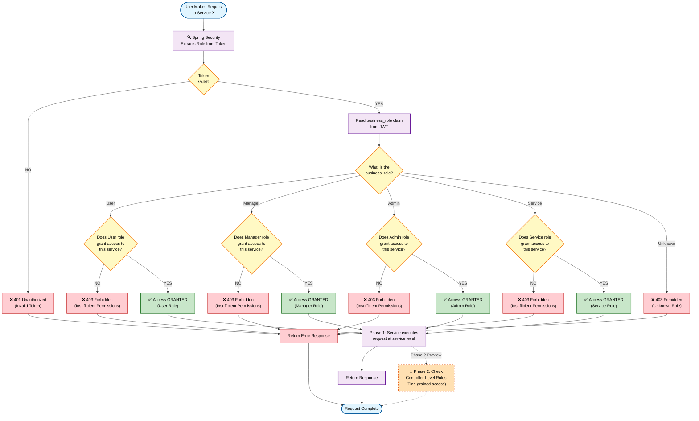

# Permission Resolution Flow - How Roles Grant Access

> **⚠️ VERIFICATION NEEDED**: Kong's exact role, positioning in request flow, and SSL/TLS handling need verification. Known issue: x.509 certificate validation in SSL handshake. Phase 2 will add controller-level decision points shown here.

## Overview

This diagram shows how permission decisions are made when a user (or service) makes a request to a microservice. The flow demonstrates how business roles translate into service-level access decisions, with explicit examples showing allowed and denied access patterns.

---

## Permission Resolution Flowchart



---

## Flowchart Explanation

### Step 1: Extract Role from Token
1. User makes request: `GET /reports/dashboard`
2. Request includes JWT token in Authorization header
3. Spring Security intercepts the request
4. **Action**: Extract `business_role` claim from JWT

### Step 2: Validate Token
5. Spring Security checks token validity
   - Is signature valid? (verify with Keycloak's public key)
   - Is token expired?
   - Is issuer trusted?

**Decision Point**:
- **Valid** → Continue to role extraction
- **Invalid** → Return 401 Unauthorized

### Step 3: Determine Role and Grant/Deny
6. Read the `business_role` value from token
7. Check if that role can access the target service

**Decision Point** (by role type):
- **User Role** → Can access: User-level services (reports, personal data, submissions)
- **Manager Role** → Can access: User + Manager services (team reports, approvals, team management)
- **Admin Role** → Can access: All services (system config, audit logs, integration setup)
- **Service Role** → Can access: API services only (batch jobs, scheduled tasks, M2M calls)
- **Unknown/Missing** → Deny access

### Step 4: Grant or Deny Access

**If Access Granted** (✅):
- Spring Security allows request to proceed
- Service executes business logic
- Response returned to user

**If Access Denied** (❌):
- Spring Security blocks request
- Returns 403 Forbidden error
- No service execution occurs

---

## Permission Decision Examples (Phase 1)

### Example 1: Manager Accessing Reports Service ✅

```
Request: GET /api/reports/team-summary
User: Jane Smith (Manager)
Token Claims: {
  sub: "jane.smith",
  group: "internal",
  business_role: "Manager",
  exp: 1700000000
}

Decision Flow:
  1. Token extracted from header ✓
  2. Token signature validated ✓
  3. Token not expired ✓
  4. business_role = "Manager"
  5. Target service = "reports-service"
  6. Can Manager access reports-service? YES ✓

Result: ✅ ACCESS GRANTED
Response: 200 OK - Team summary report
```

### Example 2: User Accessing Admin Service ❌

```
Request: POST /api/admin/system-config
User: Bob Wilson (User)
Token Claims: {
  sub: "bob.wilson",
  group: "internal",
  business_role: "User",
  exp: 1700000000
}

Decision Flow:
  1. Token extracted from header ✓
  2. Token signature validated ✓
  3. Token not expired ✓
  4. business_role = "User"
  5. Target service = "admin-service"
  6. Can User access admin-service? NO ✗

Result: ❌ ACCESS DENIED (403 Forbidden)
Response: 403 - Insufficient permissions for this operation
```

### Example 3: Service Role Calling Batch Job API ✅

```
Request: POST /api/jobs/batch-process
Service: Scheduler Service (Service Role)
Token Claims: {
  sub: "scheduler-service",
  group: "services",
  business_role: "Service",
  exp: null (no expiry for service principals)
}

Decision Flow:
  1. Token extracted from header ✓
  2. Token signature validated ✓
  3. business_role = "Service"
  4. Target service = "batch-job-service"
  5. Can Service role access batch-job-service? YES ✓

Result: ✅ ACCESS GRANTED
Response: 200 OK - Batch job queued
```

### Example 4: External User Accessing Internal Data ❌

```
Request: GET /api/reports/internal/Q4-summary
User: Alice Chen (Contractor, User role)
Token Claims: {
  sub: "alice.chen",
  group: "external",
  business_role: "User",
  exp: 1700000000
}

Decision Flow:
  1. Token extracted from header ✓
  2. Token signature validated ✓
  3. Token not expired ✓
  4. business_role = "User"
  5. Target service = "reports-service"
  6. Can User access reports-service?
     → Depends on service-level rules
     → "reports-service" may have group-based restrictions
     → External User denied from internal data

Result: ❌ ACCESS DENIED (403 Forbidden)
Response: 403 - External users cannot access internal reports
```

### Example 5: Admin Accessing Any Service ✅

```
Request: ANY /api/{service}/*
User: Carol Davis (Admin)
Token Claims: {
  sub: "carol.davis",
  group: "internal",
  business_role: "Admin",
  exp: 1700000000
}

Decision Flow:
  1. Token extracted from header ✓
  2. Token signature validated ✓
  3. Token not expired ✓
  4. business_role = "Admin"
  5. Target service = any
  6. Can Admin access {service}? YES ✓ (for all services)

Result: ✅ ACCESS GRANTED
Response: Service-specific response
```

---

## Role-to-Service Access Matrix (Phase 1)

| Service | User | Manager | Admin | Service | External | Note |
|---------|:----:|:-------:|:-----:|:-------:|:--------:|------|
| reports-service | ✅ | ✅ | ✅ | ❌ | ⚠️ (internal only) | User can view own, Manager can view team |
| approval-service | ❌ | ✅ | ✅ | ❌ | ❌ | Manager and above only |
| admin-service | ❌ | ❌ | ✅ | ❌ | ❌ | Admin only |
| batch-job-service | ❌ | ❌ | ✅ | ✅ | ❌ | Service role and Admin only |
| user-profile-service | ✅ | ✅ | ✅ | ❌ | ✅ | All users can view own profile |
| public-data-service | ✅ | ✅ | ✅ | ✅ | ✅ | All roles can access |

**Note**: External user access depends on additional service-level rules (not shown in base role matrix).

---

## Phase 1 vs Phase 2 Comparison

### Phase 1: Service-Level Checks (Current Implementation)
```
Token → Extract Role →
  Check: Can this role access this SERVICE? →
    YES: Service executes → Response
    NO: 403 Forbidden
```

**Characteristics**:
- Coarse-grained (service-level)
- Fast decision (one lookup)
- Limited granularity
- Works for organizational separation

### Phase 2: Controller-Level Checks (Preview)
```
Token → Extract Role →
  Check 1: Can this role access this SERVICE?
  Check 2: Can this role access this ENDPOINT?
  Check 3: Are additional rules satisfied? (e.g., time-based, attribute-based)
    ALL YES: Service executes → Response
    ANY NO: 403 Forbidden
```

**Characteristics**:
- Fine-grained (endpoint/controller level)
- More complex decisions (multiple checks)
- Higher granularity
- Works for advanced use cases

---

## Implementation Details (Spring Security)

### Token Extraction
```java
// Spring Security automatically extracts JWT token
JwtAuthenticationConverter converter = new JwtAuthenticationConverter();
converter.setJwtGrantedAuthoritiesConverter(jwt -> {
    String role = jwt.getClaimAsString("business_role");
    return Collections.singleton(
        new SimpleGrantedAuthority("ROLE_" + role)
    );
});
```

### Role Check in Controller
```java
@GetMapping("/api/reports/team-summary")
@PreAuthorize("hasRole('MANAGER') or hasRole('ADMIN')")
public ResponseEntity<ReportDTO> getTeamReport() {
    // Only Manager and Admin can access
    return ResponseEntity.ok(reportService.getTeamReport());
}
```

### Service-Level Configuration
```yaml
security:
  authorization:
    services:
      reports-service:
        allowed_roles: [User, Manager, Admin]
      admin-service:
        allowed_roles: [Admin]
      batch-job-service:
        allowed_roles: [Admin, Service]
```

---

## Key Design Principles

### 1. **Token-Driven Decisions**
- All role information comes from JWT
- No database lookup needed for role check
- Stateless and scalable

### 2. **Fail-Secure**
- Unknown or missing roles deny access
- Invalid tokens reject immediately
- Default is deny (not allow)

### 3. **Centralized Permission Logic**
- Spring Security handles role extraction
- Services declare required roles via annotations
- Configuration defines service-to-role mapping

### 4. **Clear Audit Trail**
- Every access decision is loggable
- Token claims provide full context
- Denied requests logged for security analysis

### 5. **Phase 1 Simplicity**
- Service-level checks only (no endpoint granularity)
- Single business role per user
- Direct role-to-service mapping

---

## Error Scenarios

### Scenario 1: Missing Token
```
Request: GET /api/reports/dashboard
Headers: (no Authorization header)

Result: 401 Unauthorized
Message: "Missing or invalid token"
Action: User redirected to login
```

### Scenario 2: Expired Token
```
Request: GET /api/reports/dashboard
Token: Valid format but exp: 1699999999 (past date)

Result: 401 Unauthorized
Message: "Token expired"
Action: User redirected to refresh token
```

### Scenario 3: Invalid Signature
```
Request: GET /api/reports/dashboard
Token: Tampered (signature doesn't match)

Result: 401 Unauthorized
Message: "Invalid token signature"
Action: User redirected to login
```

### Scenario 4: Insufficient Role
```
Request: POST /api/admin/system-config
Token: Valid, business_role: "User"

Result: 403 Forbidden
Message: "Your role does not have permission for this operation"
Action: User sees permission denied message
```

---

## Audit & Compliance

### Logged Data (Every Request)
- Timestamp
- User ID / Service ID
- Token claims (role, group, etc.)
- Requested resource/endpoint
- Decision (allow/deny)
- Error code (if denied)

### Compliance Implications
- Clear audit trail for role assignments
- Easy to trace permission changes
- Role changes reflected immediately in tokens
- Historical record of access patterns

---

## Notes

- Phase 1 focuses on service-level granularity
- Phase 2 will add controller/endpoint-level rules
- Token validation is performed on every request
- Role inheritance is checked at service authorization layer
- Future enhancements: attribute-based access control (ABAC)
