# Business Role Hierarchy - Target Model

> **⚠️ VERIFICATION NEEDED**: Kong's exact role, positioning in request flow, and SSL/TLS handling need verification. Known issue: x.509 certificate validation in SSL handshake.

## Overview

This diagram shows the hierarchical organization of business roles in the target state model. The target model uses three user groups (External Users, Internal Users, Services) that assign business roles with clear escalation paths and inheritance patterns.

---

## Role Hierarchy Diagram

```mermaid
graph TB
    subgraph Groups["User Groups"]
        direction TB
        EU["👥 External Users<br/>(Outside Organization)"]
        IU["👥 Internal Users<br/>(Employees)"]
        SVC["⚙️ Services<br/>(Machine-to-Machine)"]
    end

    subgraph BusinessRoles["Business Roles"]
        direction TB
        USER["👤 User<br/>(Base Level)"]
        MGR["👔 Manager<br/>(Mid Level)"]
        ADM["👑 Admin<br/>(Top Level)"]
        SRVC["🤖 Service<br/>(M2M Role)"]
    end

    subgraph RoleDefinitions["Role Definitions & Capabilities"]
        direction TB

        subgraph UserDef["User Role"]
            U1["• Read public data"]
            U2["• Access own resources"]
            U3["• Submit requests"]
            U4["• View basic reports"]
        end

        subgraph MgrDef["Manager Role"]
            M1["• All User capabilities"]
            M2["• Review team submissions"]
            M3["• Approve requests"]
            M4["• View team reports"]
            M5["• Manage users below"]
        end

        subgraph AdminDef["Admin Role"]
            A1["• All Manager capabilities"]
            A2["• System configuration"]
            A3["• Audit logs access"]
            A4["• Role management"]
            A5["• Service integration"]
        end

        subgraph ServiceDef["Service Role"]
            S1["• System-to-System calls"]
            S2["• API integration"]
            S3["• Batch operations"]
            S4["• Background jobs"]
        end
    end

    subgraph Escalation["Role Escalation Paths"]
        direction TB
        ESCAL["User ➜ Manager ➜ Admin<br/>(Hierarchical Escalation)"]
    end

    subgraph Examples["Concrete Assignment Examples"]
        direction TB

        EX1["🔹 External User → User Role<br/>Contractor accessing reports"]
        EX2["🔹 Internal User → User Role<br/>New employee with basic access"]
        EX3["🔹 Internal User → Manager Role<br/>Department lead managing team"]
        EX4["🔹 Internal User → Admin Role<br/>IT admin managing system"]
        EX5["🔹 Service Group → Service Role<br/>Scheduler service for batch jobs"]
    end

    %% Group to Role Assignments
    EU -->|can assign| USER
    IU -->|can assign| USER
    IU -->|can assign| MGR
    IU -->|can assign| ADM
    SVC -->|can assign| SRVC

    %% Role Definitions
    USER -->|defines| UserDef
    MGR -->|defines| MgrDef
    ADM -->|defines| AdminDef
    SRVC -->|defines| ServiceDef

    %% Escalation Paths
    USER -->|escalates to| MGR
    MGR -->|escalates to| ADM

    %% Examples
    Examples -->|illustrates| Escalation

    %% Styling
    classDef groupStyle fill:#e3f2fd,stroke:#1976d2,stroke-width:2px,color:#000
    classDef roleStyle fill:#f3e5f5,stroke:#7b1fa2,stroke-width:2px,color:#000
    classDef defStyle fill:#e8f5e9,stroke:#388e3c,stroke-width:1px,color:#000
    classDef exampleStyle fill:#fff3e0,stroke:#f57c00,stroke-width:2px,color:#000
    classDef escalationStyle fill:#fce4ec,stroke:#c2185b,stroke-width:2px,color:#000

    class EU,IU,SVC groupStyle
    class USER,MGR,ADM,SRVC roleStyle
    class UserDef,MgrDef,AdminDef,ServiceDef defStyle
    class EX1,EX2,EX3,EX4,EX5 exampleStyle
    class Escalation escalationStyle
```



---

## Hierarchy Explanation

### User Groups (Assignment Authority)

#### External Users
- **Who**: Contractors, partners, external stakeholders
- **Can Assign**: User role only
- **Reasoning**: Limited access, no internal elevation
- **Token Claim**: `group="external"`

#### Internal Users
- **Who**: Employees, team members, staff
- **Can Assign**: User, Manager, Admin roles
- **Reasoning**: Full organizational hierarchy
- **Token Claim**: `group="internal"`

#### Services
- **Who**: Automated systems, batch jobs, service-to-service integration
- **Can Assign**: Service role only
- **Reasoning**: System integration, not user-facing
- **Token Claim**: `group="services"`

### Business Roles (Access Authority)

#### User Role
**Level**: Base / Entry-level
- Read-only access to own data
- Can submit requests
- View basic reports
- Cannot approve or manage
- **Service Access**: Public and user-level endpoints

#### Manager Role
**Level**: Mid / Supervisory
- Inherits all User capabilities
- Approve requests from team members
- View team-level reports and data
- Manage users in team (assign tasks, etc.)
- **Service Access**: Team management and reporting endpoints

#### Admin Role
**Level**: Top / Administrative
- Inherits all Manager capabilities
- Full system configuration access
- Audit logs and compliance
- Role and permission management
- Service integration management
- **Service Access**: All endpoints including admin functions

#### Service Role
**Level**: Machine-to-Machine
- System-to-system integration
- No user-facing access
- Batch job execution
- API-only operations
- **Service Access**: Specific service-level APIs only

---

## Role Assignment Pattern

### Decision Flow

```
User needs access?
    ↓
What is their group?
    ├─→ External Users? → Can assign: User only
    ├─→ Internal Users? → Can assign: User, Manager, Admin
    └─→ Services? → Can assign: Service only
        ↓
Which role meets their business need?
    ├─→ Read-only access? → User role
    ├─→ Team management? → Manager role
    ├─→ System admin? → Admin role
    └─→ Service integration? → Service role
```

### Token Structure

When a user is assigned a role, their JWT token contains:

```json
{
  "sub": "jane.smith",
  "group": "internal",
  "business_role": "Manager",
  "roles": ["Manager"],
  "aud": "microservices",
  "exp": 1700000000
}
```

---

## Key Design Principles

### 1. **Group-Based Assignment**
- Users belong to one group (External, Internal, or Services)
- Group membership determines which roles can be assigned
- Clear organizational boundaries

### 2. **Hierarchical Escalation**
- User < Manager < Admin (escalation path)
- Each level inherits lower-level capabilities
- No "lateral" roles or role mixing

### 3. **Simple & Auditable**
- One business role per user context
- Clear role definitions
- Easy to understand who can do what

### 4. **Service-Level Mapping**
- Business roles map directly to service-level access
- No additional mapping layer needed
- Reduces decision complexity

### 5. **Future Extensibility**
- Phase 2 will add role attributes for fine-grained control
- Controller/endpoint-level rules will reference business roles
- Core hierarchy remains unchanged

---

## Practical Examples

### Scenario 1: New Employee
```
Action: Jane joins as an analyst
Group Assignment: Internal Users
Role Assignment: User
Token: {group: "internal", business_role: "User"}
Access: Read reports, submit requests, view own data
Audit Trail: Created 2025-11-20, assigned by HR system
```

### Scenario 2: Promotion to Team Lead
```
Action: Jane promoted to team lead
Group Assignment: Internal Users (unchanged)
Role Assignment: Manager
Token: {group: "internal", business_role: "Manager"}
Access: All User access + approve team requests, view team reports
Audit Trail: Updated 2025-11-22, assigned by HR system
```

### Scenario 3: IT Admin Addition
```
Action: Bob needs system administration access
Group Assignment: Internal Users
Role Assignment: Admin
Token: {group: "internal", business_role: "Admin"}
Access: All Manager access + system configuration, audit logs
Audit Trail: Created 2025-11-15, assigned by Security team
```

### Scenario 4: External Contractor
```
Action: Alice is a contractor for 6 months
Group Assignment: External Users
Role Assignment: User (only option)
Token: {group: "external", business_role: "User"}
Access: Limited to public data and contractor-specific resources
Audit Trail: Created 2025-11-10, expires 2026-05-10
```

### Scenario 5: Service Integration
```
Action: Scheduler needs to run batch jobs
Group Assignment: Services
Role Assignment: Service
Token: {group: "services", business_role: "Service"}
Access: Batch job APIs, scheduled task endpoints
Audit Trail: Created by DevOps, no expiration (service principal)
```

---

## Comparison with Current State

### Old Model
- Multiple overlapping roles per user
- Group A/B with dozens of service-level roles
- Role bloat and permission creep
- Difficult to audit
- Example: 1 user → 15+ service roles

### New Model (Target)
- Single business role per user context
- Three groups with clear boundaries
- Simple escalation path
- Easy to audit and understand
- Example: 1 user → 1 business role

---

## Migration Implications

When migrating from current to target model:

1. **User Group Assignment**: Place each user in External, Internal, or Services
2. **Role Downgrade**: Map service roles to single business role (take minimum required)
3. **Verification**: Audit tool to validate role assignments match business needs
4. **Gradual Rollout**: Phase by department or service

---

## Notes

- Role hierarchy is **NOT** enforced at the role level—services must check role values
- Token claims are extracted and validated by Spring Security
- Role inheritance is conceptual (documented here) but implemented as explicit checks
- Future: Phase 2 will add attributes and fine-grained rules to this hierarchy
