```mermaid
flowchart TD
    Start([User: Jane - Internal Employee]) --> Login["📱 Login via React UI"]

    Login --> Keycloak["🔐 Keycloak<br/>(Identity Provider)"]

    Keycloak --> Authenticate["Authenticate Jane's<br/>Credentials"]
    Authenticate --> GroupLookup["Determine Group:<br/>Internal Users"]

    subgraph GroupAssignment["Group Assignment"]
        GroupLookup --> RoleAssign["Assign Business Role:<br/>Manager"]
    end

    GroupAssignment --> TokenGen["Generate JWT Token<br/>with Manager Role"]

    subgraph Authorization["Authorization Check"]
        TokenGen --> Kong["🚪 Kong API Gateway<br/>(Token Validation)"]
        Kong --> ValidateToken["Validate Token<br/>& Extract Role"]
    end

    ValidateToken --> Route["Route Request to<br/>reports-service"]

    subgraph ServiceAccess["Service Access Control"]
        Route --> SpringCheck["🔍 Spring Security<br/>(Role Check)"]
        SpringCheck --> RoleMatch{Does Token<br/>contain<br/>Manager Role?}
    end

    RoleMatch -->|YES| Grant["✅ Access GRANTED"]
    RoleMatch -->|NO| Deny["❌ Access DENIED"]

    Grant --> ServiceResponse["reports-service<br/>Returns Response"]
    ServiceResponse --> End([Response to User])

    Deny --> ErrorResponse["Return 403 Forbidden"]
    ErrorResponse --> End

    style Start fill:#e1f5ff
    style Login fill:#e1f5ff
    style Keycloak fill:#fff3e0
    style Kong fill:#fff3e0
    style SpringCheck fill:#f3e5f5
    style Grant fill:#c8e6c9
    style Deny fill:#ffcdd2
    style End fill:#e1f5ff
```

# Simple User Journey - New Authorization Model (Phase 1)

## Overview

This diagram shows a single user journey through the new simplified authorization model, focusing on Phase 1 implementation. The flow demonstrates how a user moves from login through role assignment to service access.

---

---

## Flow Explanation

### Phase 1: User Login & Authentication
1. **User logs in** via React UI (e.g., Jane - Internal Employee)
2. **Keycloak authenticates** Jane's credentials
3. **Keycloak determines Jane's group**: "Internal Users"
4. **Group-to-Role mapping**: "Internal Users" group is assigned the "Manager" business role
5. **Token generation**: Keycloak generates JWT with "Manager" role embedded

### Phase 1: Authorization & Access
6. **Kong validates** the JWT token
7. **Kong routes** the request to the target microservice (e.g., "reports-service")
8. **Spring Security checks** if the "Manager" role matches service requirements
9. **Access decision**:
   - If role matches → ✅ Access granted, service responds
   - If role doesn't match → ❌ Access denied (403 Forbidden)

---

## Key Design Patterns (Phase 1)

### Simple & Direct
- **One-to-one mapping**: Group → Business Role → Service Access
- **No role accumulation**: Single role per user context
- **Clear authority**: Only the business role matters for service access

### Security Benefits
- Reduced attack surface (fewer roles per user)
- Easier permission auditing
- Clear delegation chain: Group → Role → Service

### Role Enforcement Points
1. **Keycloak**: Assigns business role based on group
2. **Kong**: Validates token and routes
3. **Spring Security**: Final access check at service level

---

## Phase 2 Future Enhancement (Planned)

> **Future Direction**: More granular controller-level permissions within a service
>
> In Phase 2, we'll extend this model to allow fine-grained access control:
> - Within a single microservice, different endpoints may require different role levels
> - Example: GET /reports/public (Manager) vs. POST /reports/sensitive (Admin only)
> - Business Role will become more granular with sub-permissions
> - Spring Security will check both role AND endpoint-specific rules

---

## Components

| Component | Role | Responsibility |
|-----------|------|-----------------|
| **React UI** | Client | User interface for login |
| **Keycloak** | Identity Provider | Authentication & group-to-role mapping |
| **Kong** | API Gateway | Token validation & routing |
| **Spring Security** | Service Guardian | Final role validation at service level |
| **Microservice** | Business Logic | Executes authorized requests |

---

## Notes

- This diagram assumes the user's group and role assignments are already configured in Keycloak
- Token validation is atomic and stateless (JWT-based)
- Access decisions are made independently at each enforcement point (defense in depth)
- Phase 2 will add endpoint-level granularity without changing this basic flow

